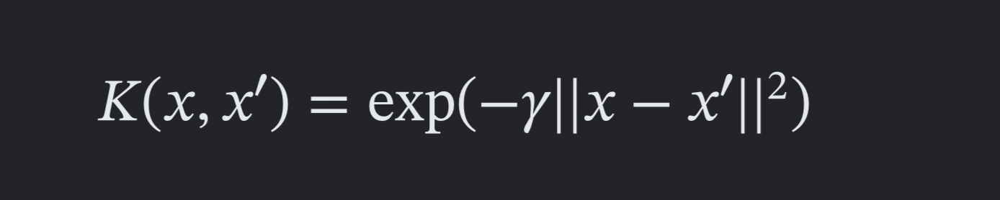
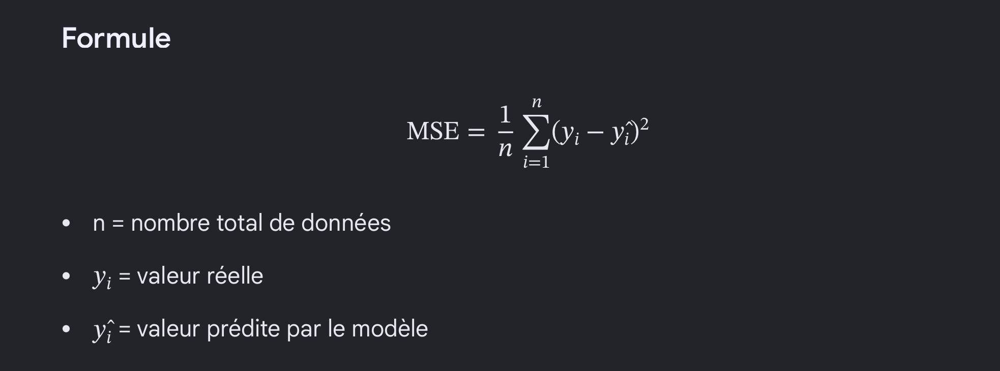
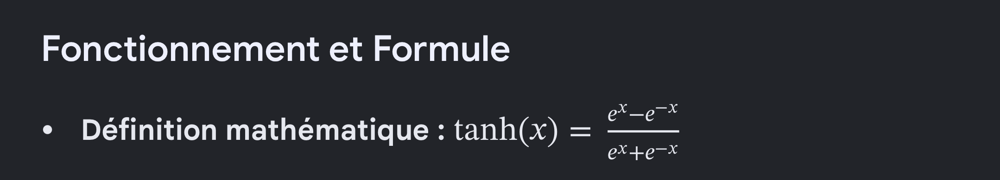

# Projet annuel 

Contexte - Vocabulaire 

* CLASSE = Quand nous parlons de classe, nous désignons une catégorie de déchet que le modèle doit reconnaître.

Exemple: 
- Classe 0 : plastique 
- Classe 1 : verre 
- Classe 2 : métal 


# Etape 1 : Test sur des données linéairement séparables
Le Perceptron simple qui est codé en C n'a aucune couche cachée et ne possède qu'un seul neurone. Le Perceptron classique (inventé par Frank Rosenblatt) est le modèle le plus basique possible : les entrées sont directement reliées à un unique neurone de sortie. Il ne peut séparer que des données parfaitement linéaires.

Comme le perceptron classique n'a besoin que d'un seul neurone, nous utilisons dans notre code en C un tableau de poids qui consiste en un vecteur à une seule dimension ([w1, w2]) - VERSUS 1 couche avec plusieurs neurones = Un tableau à 2 dimensions (une matrice de poids).

Un algorithme beaucoup plus puissant est le Perceptron Multicouche (MLP) entraîné par rétropropagation du gradient.


L'objectif est de tester le modèle sur plusieurs cas simples et connus, avant de les appliquer à la problématique réelle. 
L'objectif est de commencer volontairement avec des problèmes très simples. Nous avons créé volontairement deux problèmes simples. 

On teste d'abord le projet avec des données linéairement séparables. 

X = np.array([
    [1, 1],
    [1, 2],
    [2, 1],
    [2, 2],
    [6, 6],
    [6, 7],
    [7, 6],
    [7, 7]
])

y = np.array([
    0, 0, 0, 0,
    1, 1, 1, 1
])


On observe que les deux groupes de données sont séparés. Il est facilement possible de tracer une droite entre les deux groupes. 


# Etape 2 : Test sur des données non linéairement séparables
Les données non linéairement séparables sont des données qu'on ne peut pas séparer correctement avec une simple droite (2D), ou un plan/hyperplan (dimension supérieure). Un modèle très simple comme un Perceptron classique cherche essentiellement à faire une séparation linéaire. Si les données sont non linéairement séparables, il peut être incapable de trouver une frontière qui sépare correctement les deux classes.


Pour cela, on utilise le problème XOR. 

modele_perceptron = Perceptron(
    max_iter=1000,
    random_state=42
)

- parenthèse sur le RANDOM STATE -
Ci-dessus, on crée un objet Perceptron et on le stocke dans la variable modele_perceptron. En mettant max_iter à 1000, on lui demande de faire 1000 itérations sur les données d'entraînement pour essayer d'apprendre. Le random_state fixé à 42 est un paramètre utilisé pour contrôler le hasard lors de l'entraînement d'un modèle comme le Perceptron. Avant de commencer à apprendre, le Perceptron doit attribuer des valeurs de départ (des poids) à ses connexions. Sans random_state, les poids sont initialisés de manière totalement aléatoire à chaque lancement. Le modèle peut donc converger vers des solutions légèrement différentes à chaque exécution. Avec random_state, le générateur de nombres aléatoires commence toujours au même "endroit". Les poids de départ seront strictement identiques à chaque fois. Le random state permet aussi de comparer les résultats obtenus: si l'on change un paramètre (comme le taux d'apprentissage), le random_state permet de mesurer que l'amélioration vient de ce changement, et non d'un coup de chance de l'initialisation aléatoire.

Graphiquement, voici les résultats :


On observe que le problème XOR n'est pas linéairement séparable. Le perceptron ne peut pas résoudre XOR car il ne peut pas construire une frontière de décision linéaire. 

Cela insiste sur la nécessité d'utiliser un PMC (Perceptron Multi Couches). Les couches de neurones cachées dans le PMC lui permettent d'apprendre des relations non linéaires. 


# Etape 3 : Perceptron Multi-Couches
L’idée est surtout de montrer que le MLP peut apprendre une séparation non linéaire entre les classes de déchets. Le modèle linéaire permet de rechercher une frontière de décision linéaire entre les différentes catégories. Cependant, les caractéristiques visuelles des déchets ne sont pas nécessairement séparables linéairement. Le perceptron multicouche introduit une ou plusieurs couches cachées ainsi que des fonctions d'activation non linéaires, ce qui permet au modèle d'apprendre des relations plus complexes entre les caractéristiques et les classes.

Première étape : Rassembler des photos de déchets 
Pour entraîner le PMC, il faut un dataset d'images étiquetées : chaque photo doit appartenir à une classe.

Deuxième étape: transformer les photos en vecteurs 
Un PMC ne peut pas directement comprendre un fichier .jpg. Il lui faut des nombres. Pour commencer simplement, on peut transformer chaque image en une petite image, par exemple 32 × 32 pixels, puis la transformer en un vecteur.

image_array = np.array(image)

Cette ligne transforme l'image en un tableau NumPy.

[
  [[255,   0,   0] (rouge), [  0, 255,   0] (vert)],
  [[  0,   0, 255] (bleu), [255, 255, 255] (blanc)]
]

(Selon les valeurs R, G, B).

image_array = image_array / 255.0 (Nombres 0–255 → nombres 0–1)

Cette ligne permet de normaliser en divisant chaque valeur de chaque pixel par 255.
Exemple: 64/255 donne 0.25.
Exemple: 128/255 donne 0.50.
Exemple: 192/255 donne 0.75.
Exemple: 255/255 donne 1.0.

En effet, comme le Perceptron va faire des calculs mathématiques avec ces valeurs, il est préférable de lui donner des valeurs dans une échelle raisonnable, ici entre 0 et 1, plutôt que des valeurs entre 0 et 255.

image_vector = image_array.flatten()

La fonction flatten() prend la grille de pixels de l'image et la transformer en une seule longue liste de nombres. En gros, cette ligne fait passer image_array de ça: 

image_array =
[
    [[1, 0, 0], [0, 1, 0]],
    [[0, 0, 1], [1, 1, 1]]
]

à ça: 

[
  1, 0, 0,
  0, 1, 0,
  0, 0, 1,
  1, 1, 1
]

<=> Ce qui est l'équivalent de ça : [1,0,0,0,1,0,0,0,1,1,1,1]. En réalité, les "neurones" de la couche d'entrée sont juste les pixels de l'image. On les appelle "neurones d'entrée" uniquement par abus de langage pour schématiser le réseau.

Une fois le vecteur obtenu, on l'ajoute au tableau X. X = les données que le modèle regarde.

                X.append(image_vector)

On ajoute son index, c'est-à-dire son numéro de classe, au tableau y. y = les réponses qu'on veut que le modèle apprenne à prédire.

                y.append(index)

Cette ligne sert à dire que l'image X appartient appartient à la classe numéro class_index (0, 1, 2). On peut donc comparer le résultat obtenu du modèle à la classe réelle (0 - plastic, 1 - verre , 2 - métal) et mesurer l'écart entre la sortie du modèle et la prédiction attendue. 

Troisième étape: 

X_train, X_test, y_train, y_test = train_test_split(
    X,
    y,
    test_size=0.2,
    random_state=42,
    stratify=y
)

Tu prends tes images et tu les sépares :
80 % → entraînement
20 % → test

Création du PMC
mlp = MLPClassifier(
    hidden_layer_sizes=(32, 16),
    activation="relu",
    solver="adam",
    max_iter=500,
    random_state=42
)

* hidden_layer_sizes=(32, 16) signifie donc deux couches cachées, une de 32 neurones et une de 16.

* activation="relu" veut dire que les neurones des couches cachées utilisent la fonction ReLU (Rectified Linear Unit).
Elle est très simple: La fonction ReLU (pour Rectified Linear Unit ou unité linéaire rectifiée) est une fonction d'activation non linéaire très populaire en apprentissage profond, définie par la formule (f(x) = max(0, x)).

Donc : 
si x < 0  → la fonction renvoie 0
si x ≥ 0  →  la fonction renvoie x

Exemple: SI 
x = -3  → ReLU(x) = 0
x = -0.5 → ReLU(x) = 0
x = 2   → ReLU(x) = 2
x = 5   → ReLU(x) = 5

Cette fonction est très importante pour le projet, car elle permet au PMC d'apprendre des relations non linéaires.
Sans fonction d'activation non linéaire, empiler plusieurs couches reviendrait essentiellement à faire encore une transformation linéaire.
En gros, ReLU introduit la non-linéarité nécessaire au perceptron multicouche pour apprendre des relations complexes entre les caractéristiques des images.

mlp.fit(X_train, y_train)

C'est ici que le PMC apprend à partir de tes photos.

photo → classe correcte

y_pred = mlp.predict(X_test)

# Implémentation en C et lien avec Python
On a écrit les algorithmes (perceptron, PMC) dans une bibliothèque en C, et on les relie ensuite à notre notebook Python pour les tester et comparer les résultats.

Concrètement, chaque algorithme (`ETAPE1.basicPerceptron.c`, `ETAPE2.xor.c`, `ETAPE3.multiLayersPerceptron.c`) est écrit sous forme de fonction, sans `main()` central bloquant l'exécution - par exemple `run_perceptron()` ou `run_pmc()`. Une fonction C classique, une fois compilée normalement, donne un programme exécutable qu'on ne peut lancer que depuis un terminal. Pour que Python puisse s'en servir, on compile ces fichiers différemment, en bibliothèque partagée (`.so`), avec la commande :

```bash
gcc -shared -fPIC ETAPE1.basicPerceptron.c -o ETAPE1.basicPerceptron.so
```

Depuis Python, le module `ctypes` (intégré à Python, rien à installer) permet ensuite de charger ce `.so` et d'appeler directement les fonctions C comme si c'était des fonctions Python :

```python
import ctypes

lib = ctypes.CDLL("C-algorithms/ETAPE1.basicPerceptron.so")
lib.run_perceptron.restype = ctypes.c_int
erreurs = lib.run_perceptron()
```

On a validé ce mécanisme sur les trois premières étapes, testées sur les cas de test :

- Étape 1 (perceptron linéaire) : 0 erreur sur les 8 points de test
- Étape 2 (XOR) : le perceptron simple échoue (2 erreurs sur 4) sur les données brutes, non linéairement séparables ; en ajoutant une caractéristique `x1 * x2` (transformation non linéaire), il converge et n'a plus aucune erreur
- Étape 3 (PMC) : après rétropropagation du gradient sur les 3 exemples de test, le réseau prédit correctement les 3 classes. Le PMC n'a qu'une seule couche cachée (8 neurones) pour rester simple à expliquer.

## Application sur une portion du vrai dataset

Une fois les algorithmes validés sur les cas de test, on les a aussi appliqués à quelques vraies photos de `dataset-img/`. Pour ça, chaque photo est réduite à 2×2 pixels (donc 12 valeurs, la même taille que les cas de test) puis normalisée entre 0 et 1, comme expliqué plus haut pour la transformation des images en vecteurs.

Première approche testée (à éviter) : calculer ces vecteurs en Python puis les recopier en dur dans le fichier `.c`. Ça ne relie pas vraiment C et Python, ça utilise juste Python comme calculatrice avant de figer les données. On a donc changé les fonctions C pour qu'elles reçoivent un pointeur vers les données, envoyées directement par Python à chaque exécution :

```c
int run_perceptron_dataset(double *vecteurs, int *labels, int n_exemples)
```

Côté Python, `ctypes` a besoin de savoir à quoi ressemblent les paramètres (`argtypes`) pour convertir correctement un tableau numpy en pointeur C :

```python
lib_etape1.run_perceptron_dataset.argtypes = [
    ctypes.POINTER(ctypes.c_double),
    ctypes.POINTER(ctypes.c_int),
    ctypes.c_int,
]
erreurs = lib_etape1.run_perceptron_dataset(vecteurs_c, labels_c, len(labels))
```

Résultats sur cette portion du dataset :
- Modèle linéaire : 0 erreur sur 4 photos (2 plastique, 2 métal)
- PMC : 6 bonnes prédictions sur 6 photos (2 plastique, 2 verre, 2 métal)

## Début de l'application (tuyauterie)

Le sujet demande à terme une application qui communique avec une API hébergeant les modèles entraînés. Pour ce rendu, on a juste commencé cette architecture, dans `app/` :

- `app/server.py` : un serveur Flask avec une seule route, `/ping`, qui répond `{"message": "le serveur fonctionne"}`
- `app/client.py` : un script Python qui appelle cette route avec la bibliothèque `requests` et affiche la réponse

Ça ne fait pas encore de prédiction, l'objectif est juste de montrer que la communication client/serveur fonctionne. Les vrais modèles (nos bibliothèques C) seront branchés dessus dans un prochain rendu.

# Etape 4 : SVM avec un noyau RBF
Un SVM avec un noyau RBF (Radial Basis Function, ou noyau gaussien) est un modèle de machine learning qui sert à classer des données ou à faire des prédictions lorsque les catégories ne peuvent pas être séparées par une simple ligne droite. 

L'astuce du noyau (kernel trick) : Quand les données forment des motifs complexes (par exemple, des cercles ou des formes entremêlées), le noyau RBF projette ces données mathématiquement dans un espace de dimension très élevée (voire infinie). 

La séparation : Dans cet espace virtuel, les données deviennent linéairement séparables, ce qui permet au SVM de tracer une frontière propre (un hyperplan) pour distinguer les différentes classes. 

Puis, le noyau RBF transforme les distances en score de similarité. Le noyau RBF applique cette formule :



Au lieu de décrire un nouveau point \(X\) par sa position géométrique (par exemple \(x_1=2, x_2=5\)), le noyau RBF va le décrire par sa ressemblance avec A, B et C.Le point X reçoit 3 nouvelles coordonnées (ses scores de similarité RBF) :
Position 1 : Similarité avec A (valeur entre 0 et 1)
Position 2 : Similarité avec B (valeur entre 0 et 1)
Position 3 : Similarité avec C (valeur entre 0 et 1)

Dans cet espace de similarité, les points qui appartiennent à la même catégorie vont naturellement se regrouper.Si \(X\) et \(A\) sont de la même classe (ex: Rouge) et proches géométriquement, leur score de similarité sera très élevé (proche de 1).Si \(B\) est d'une autre classe (ex: Bleu) et éloigné, son score avec \(X\) sera proche de 0.En répétant cela pour tous les points, les points "Rouges" se retrouvent avec des coordonnées élevées sur certains axes, et les "Bleus" sur d'autres axes. Magiquement, dans cette nouvelle dimension supérieure, les groupes se séparent et forment des blocs distincts.

Le tracé de l'hyperplan
C'est ici que le SVM fait son travail classique. Puisque les données sont désormais regroupées de façon logique dans cet espace à N dimensions, il devient possible de faire passer un hyperplan (une coupe parfaitement droite) entre le bloc des Rouges et le bloc des Bleus.

Le noyau RBF ne courbe pas l'hyperplan. L'hyperplan reste strictement droit. C'est le fait de redéfinir la position des points uniquement par leurs scores de proximité qui tord la réalité d'origine et permet à un outil rigide (l'hyperplan) de séparer des formes complexes.

# Etape 5 : RBF Network (Radial Basis Function Networks)
Les Réseaux de Fonctions de Base Radiale, ou Radial Basis Function Networks (RBFN), constituent une classe spécifique de réseaux de neurones artificiels. Leur caractéristique distinctive réside dans l’utilisation de fonctions de base radiale comme fonctions d’activation dans leur couche cachée. Un RBFN est typiquement structuré en trois couches : une couche d’entrée qui reçoit les données brutes, une couche cachée non linéaire basée sur des RBF, et une couche de sortie linéaire qui combine les activations de la couche cachée pour produire le résultat final. Ils sont principalement utilisés pour des tâches d’approximation de fonctions, de classification et de prédiction de séries temporelles.

Contrairement aux réseaux classiques qui utilisent des fonctions d'activation globales (comme les sigmoïdes ou ReLU) influençant tout l'espace d'entrée, chaque neurone de la couche cachée d'un RBF possède un centre et agit comme une « île d'influence ». Le neurone ne s'active que si l'entrée est proche de son centre (souvent via une fonction gaussienne). 

Théoriquement et structurellement, un réseau RBF ne comporte qu'une seule couche cachée, ce qui lui permet d'assurer une approximation universelle sans nécessiter la superposition de multiples couches intermédiaires. 


# Difficultés rencontrées
Pour le choix des images, attention à ne pas prendre que des images avec un fond blanc, de peur que le modèle fasse de fausses prédictions. 

# Définitions de notions (annexes)

# Régression linéaire 
Quand on effectue une régression linéaire en machine learning, on cherche principalement à modéliser la relation linéaire entre une variable cible (ce que l'on veut prédire) et une ou plusieurs variables prédictives (les caractéristiques ou features) afin de faire des prédictions continues.

L'objectif est de trouver la "ligne" mathématique idéale. 

On cherche à déterminer l’équation d'une ligne droite (en 2D), d'un plan (en 3D) ou d'un hyperplan (en dimensions supérieures) qui passe au plus près de l'ensemble des points de données.

Mathématiquement, on cherche à calculer les coefficients optimaux (les poids w et l'ordonnée à l'origine b) de l'équation.

Pour trouver cette ligne idéale, l'algorithme cherche à minimiser une fonction de coût, le plus souvent l'Erreur Quadratique Moyenne (MSE - Mean Squared Error). En clair, on veut que l'écart (le résidu) entre les vraies valeurs de nos données et les valeurs prédites par notre ligne soit le plus petit possible.

Le sens de la relation : Un coefficient positif signifie que si la variable x augmente, la cible y augmente aussi.

# MSE
Le MSE (Mean Squared Error, ou erreur quadratique moyenne) est une mesure mathématique qui calcule la moyenne des carrés des écarts entre les valeurs prédites par un modèle et les valeurs réelles.

Pénalisation : Élever les erreurs au carré donne un poids beaucoup plus important aux grandes erreurs. Un modèle commettant une grosse erreur est donc très fortement pénalisé.




# Tangente hyperbolique (tanh)
Une tangente hyperbolique est une fonction d'activation non linéaire utilisée dans les réseaux de neurones pour transformer des valeurs d'entrée en une plage comprise entre -1 et 1.

La principale différence entre la fonction tanh (tangente hyperbolique) et la fonction sigmoïde réside dans leur plage de valeurs de sortie et leur centrage sur zéro. 

tanh: ses sorties oscillent entre -1 et 1. 



# Fonction sigmoïde 
La principale différence entre la fonction tanh (tangente hyperbolique) et la fonction sigmoïde réside dans leur plage de valeurs de sortie et leur centrage sur zéro. 


