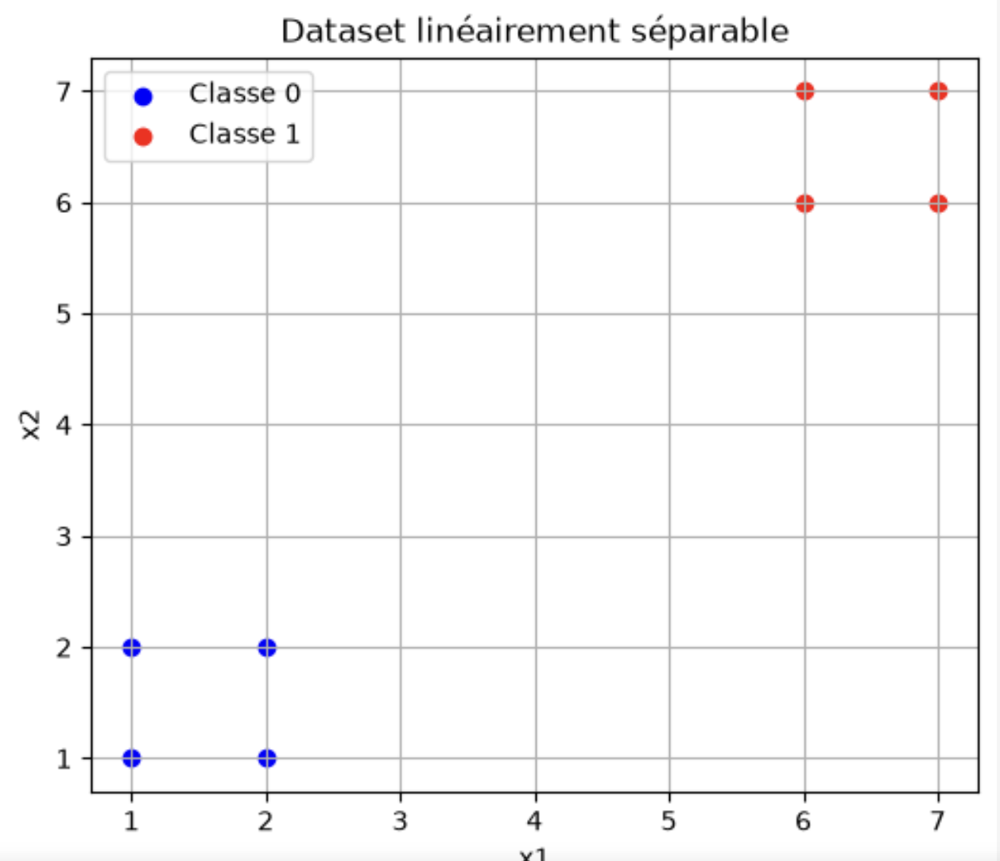

# Projet annuel 

Contexte - Vocabulaire 

* CLASSE = Quand nous parlons de classe, nous désignons une catégorie de déchet que le modèle doit reconnaître.

Exemple: 
- Classe 0 : plastique 🧴
- Classe 1 : verre 🍾
- Classe 2 : métal 🥫

# First step
L'objectif est de tester le modèle sur plusieurs cas simples et connus, avant de les appliquer à la problématique réelle. 
L'objectif est de commencer volontairement avec des problèmes très simples. 

Nous avons créé volontairement deux problèmes simples. 

1. Données linéairement séparables

On teste d'abord le projet avec des données linéairement séparables. 

X = np.array([
    [1, 1],
    [1, 2],
    [2, 1],
    [2, 2],
    [6, 6],
    [6, 7],
    [7, 6],
    [7, 7]
])

y = np.array([
    0, 0, 0, 0,
    1, 1, 1, 1
])

On observe que les deux groupes de données sont séparés. Il est facilement possible de tracer une droite entre les deux groupes. 

2. Données non linéairement séparables

Les données non linéairement séparables sont des données qu'on ne peut pas séparer correctement avec une simple droite (2D), ou un plan/hyperplan (dimension supérieure). Un modèle très simple comme un perceptron cherche essentiellement à faire une séparation linéaire. Si les données sont non linéairement séparables, il peut être incapable de trouver une frontière qui sépare correctement les deux classes.

Pour cela, on utilise le problème XOR. 

modele_perceptron = Perceptron(
    max_iter=1000,
    random_state=42
)

* RANDOM STATE 
Ci-dessus, on crée un objet Perceptron et on le stocke dans la variable modele_perceptron. En mettant max_iter à 1000, on lui demande de faire 1000 itérations sur les données d'entraînement pour essayer d'apprendre. Le random_state fixé à 42 est un paramètre utilisé pour contrôler le hasard lors de l'entraînement d'un modèle comme le Perceptron. Avant de commencer à apprendre, le Perceptron doit attribuer des valeurs de départ (des poids) à ses connexions. Sans random_state, les poids sont initialisés de manière totalement aléatoire à chaque lancement. Le modèle peut donc converger vers des solutions légèrement différentes à chaque exécution. Avec random_state, le générateur de nombres aléatoires commence toujours au même "endroit". Les poids de départ seront strictement identiques à chaque fois. Le random state permet aussi de comparer les résultats obtenus: si l'on change un paramètre (comme le taux d'apprentissage), le random_state permet de mesurer que l'amélioration vient de ce changement, et non d'un coup de chance de l'initialisation aléatoire.

Graphiquement, voici les résultats :

On observe que le problème XOR n'est pas linéairement séparable. Le perceptron ne peut pas résoudre XOR car il ne peut pas construire une frontière de décision linéaire. 

Cela insiste sur la nécessité d'utiliser un PMC (Perceptron Multi Couches). Les couches de neurones cachées dans le PMC lui permettent d'apprendre des relations non linéaires. 

3. Perceptron Multi-Couches

L’idée est surtout de montrer que le MLP peut apprendre une séparation non linéaire entre les classes de déchets. Le modèle linéaire permet de rechercher une frontière de décision linéaire entre les différentes catégories. Cependant, les caractéristiques visuelles des déchets ne sont pas nécessairement séparables linéairement. Le perceptron multicouche introduit une ou plusieurs couches cachées ainsi que des fonctions d'activation non linéaires, ce qui permet au modèle d'apprendre des relations plus complexes entre les caractéristiques et les classes.

Première étape : Rassembler des photos de déchets 
Pour entraîner le PMC, il faut un dataset d'images étiquetées : chaque photo doit appartenir à une classe.

Deuxième étape: transformer les photos en vecteurs 
Un PMC ne peut pas directement comprendre un fichier .jpg. Il lui faut des nombres. Pour commencer simplement, on peut transformer chaque image en une petite image, par exemple 32 × 32 pixels, puis la transformer en un vecteur.

image_array = np.array(image)

Cette ligne transforme l'image en un tableau NumPy.

[
  [[255,   0,   0] (rouge), [  0, 255,   0] (vert)],
  [[  0,   0, 255] (bleu), [255, 255, 255] (blanc)]
]

(Selon les valeurs R, G, B).

image_array = image_array / 255.0 (Nombres 0–255 → nombres 0–1)

Cette ligne permet de normaliser en divisant chaque valeur de chaque pixel par 255.
Exemple: 64/255 donne 0.25.
Exemple: 128/255 donne 0.50.
Exemple: 192/255 donne 0.75.
Exemple: 255/255 donne 1.0.

En effet, comme le Perceptron va faire des calculs mathématiques avec ces valeurs, il est préférable de lui donner des valeurs dans une échelle raisonnable, ici entre 0 et 1, plutôt que des valeurs entre 0 et 255.

image_vector = image_array.flatten()

La fonction flatten() prend la grille de pixels de l'image et la transformer en une seule longue liste de nombres. En gros, cette ligne fait passer image_array de ça: 

image_array =
[
    [[1, 0, 0], [0, 1, 0]],
    [[0, 0, 1], [1, 1, 1]]
]

à ça: 

[
  1, 0, 0,
  0, 1, 0,
  0, 0, 1,
  1, 1, 1
]

<=> Ce qui est l'équivalent de ça : [1,0,0,0,1,0,0,0,1,1,1,1]

Troisième étape: 

X_train, X_test, y_train, y_test = train_test_split(
    X,
    y,
    test_size=0.2,
    random_state=42,
    stratify=y
)
Tu prends tes images et tu les sépares :
80 % → entraînement
20 % → test

Création du PMC
mlp = MLPClassifier(
    hidden_layer_sizes=(32, 16),
    activation="relu",
    solver="adam",
    max_iter=500,
    random_state=42
)

* hidden_layer_sizes=(32, 16) signifie donc deux couches cachées, une de 32 neurones et une de 16.

* activation="relu" veut dire que les neurones des couches cachées utilisent la fonction ReLU (Rectified Linear Unit).
Elle est très simple :

ReLU(x)=max(0,x)

Donc : 
si x < 0  →  0
si x ≥ 0  →  x

SI 
x = -3  → ReLU(x) = 0
x = -0.5 → ReLU(x) = 0
x = 2   → ReLU(x) = 2
x = 5   → ReLU(x) = 5

Cette fonction est très importante pour le projet, car elle permet au PMC d'apprendre des relations non linéaires.
Sans fonction d'activation non linéaire, empiler plusieurs couches reviendrait essentiellement à faire encore une transformation linéaire.
En gros, ReLU introduit la non-linéarité nécessaire au perceptron multicouche pour apprendre des relations complexes entre les caractéristiques des images.

mlp.fit(X_train, y_train)

C'est ici que le PMC apprend à partir de tes photos.

photo → classe correcte

y_pred = mlp.predict(X_test)

# Difficultés rencontrées
Pour le choix des images, attention à ne pas prendre que des images avec un fond blanc, de peur que le modèle fasse de fausses prédictions. 
